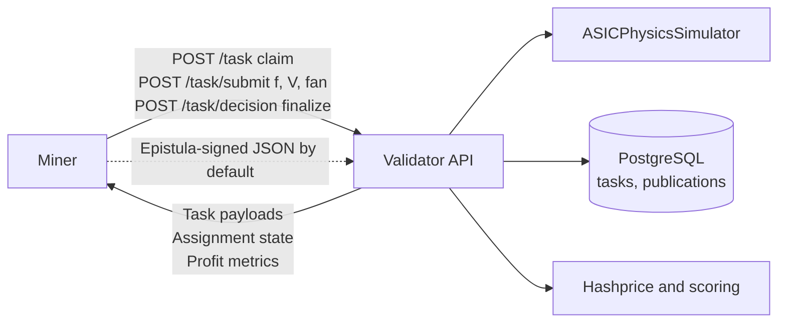

# TensorClock

**Bittensor subnet for decentralized ASIC mining optimization.** Miners explore frequency, voltage, and fan settings against a shared **physical simulator**; validators expose a **FastAPI** task API, persist state in **PostgreSQL**, and score contributions from verifiable simulation outcomes—net profit under real electricity and market (hashprice) assumptions.

TensorClock turns static firmware-style tuning into a **competitive, continuously improving** optimization layer for proof-of-work hardware, without requiring miners to own physical rigs for subnet participation (tasks use **virtual devices** with hidden parameters).

---

## Overview

Industrial mining often runs **semi-static** profiles. Electricity prices, ambient conditions, and per-device variance all change the economically optimal operating point. TensorClock incentivizes miners to build strategies that maximize **simulated** mining economics (hashprice-based revenue minus power cost) across diverse virtual ASICs and environments, while enforcing **hardware-safe** physics and thermal limits in simulation.

---

## How it works



1. Miners discover validator HTTP endpoints (on-chain commitments or a direct `--validator-url`).
2. A **publication** groups multiple **assignments** (tasks). Each task fixes ASIC model, ambient level, and optimization **target** (`efficiency`, `hashrate`, or `balanced`).
3. The miner proposes **optimization parameters**; the validator runs the **simulator**, updates assignment state, and returns economics (`net_profit_usd_day`, etc.).
4. Scoring and weight logic live in the validator stack (`validator/`, `utils/`).

---

## Core components

| Area | Role |
|------|------|
| **`validator/`** | Bittensor validator process, **FastAPI** HTTP API (`validator_api.py`), task/publication lifecycle, scoring hooks. |
| **`simulation/`** | **ASICPhysicsSimulator**, virtual device generation, ambient and hardware limit models. |
| **`miner/`** | **`MinerModel`** template, **`ValidatorClient`**, **`MinerRunner`** orchestration, Epistula helpers. |
| **`miner_references/`** | Runnable reference miners (e.g. S19 family) for integration testing. |
| **`utils/`** | Config loading, DB init, Epistula signing, logging, hashprice helpers. |
| **PostgreSQL** | Required for **validators** (tasks, publications, devices—not needed on a pure miner host). |

---

## Getting started

**Prerequisites**

- **Linux** (recommended for validators and miners).
- **Python** 3.11+ (`requirements.txt`; guides often use **3.12** with conda).
- **Bittensor** wallet with hotkey registered on the target **netuid** (see Bittensor docs for registration).

**Install (development)**

```bash
cd tensorclock
pip install -r requirements.txt
pip install -e .
```

Use a conda environment if you prefer (see the run guides).

---

## Documentation

| Document | Audience |
|----------|----------|
| [**docs/run_validator.md**](docs/run_validator.md) | Operators: PostgreSQL, conda, config. |
| [**docs/run_miner.md**](docs/run_miner.md) | Operators: reference miners, discovery. |
| [**docs/build_miner.md**](docs/build_miner.md) | Developers: HTTP contract (claim/submit/decision), `MinerModel`, local testing vs a validator. |

---

## For validators

- Provision **PostgreSQL**, set `validator.database_url` (and API bind options) in `configs/validator_config.toml`.
- Run `python utils/init_db.py` once, then start with `python -m validator.validator` from the repo root after `pip install -e .`.
- Expose the HTTP API where miners can reach it; document the URL in your **on-chain commitment** if you rely on discovery.

Full checklist: [**docs/run_validator.md**](docs/run_validator.md).

---

## For miners

- Implement a **`MinerModel`** (see [**docs/build_miner.md**](docs/build_miner.md)) or run a **reference** script under `miner_references/`.
- Point at validators via **`miner.validator_url`** or metagraph discovery; requests use **Epistula** signing by default (`utils/epistula.py`).

Operator guide: [**docs/run_miner.md**](docs/run_miner.md).

---

## Configuration

- **Validator:** `configs/validator_config.toml` — database URL, network, netuid, wallet, API host/port.
- **Miner:** `configs/miner_config.toml` — network, netuid, wallet, optional fixed validator URL, ASIC model / target defaults.

## Links

- **Docs index:** [`docs/`](docs/)
- **Dashboard website:** [`tensorclock.com`](https://tensorclock.com/)
